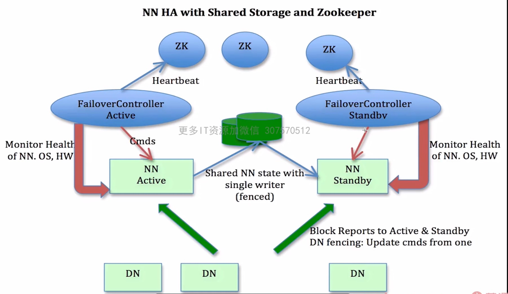

# Hadoop

官网：hadoop.apache.org

源码：github.com/apache/hadoop

创始人：Doug Cutting

## 1.Hadoop modules

### 1.1Hadoop Commons

Hadoop公用的支撑工具组件

### 1.2HDFS(Hadoop Distributed File System)

Hadoop分布式文件系统，分布式存储

源自于Google的GFS（Google File System）论文

### 1.3Hadoop Yarn（Yet Another Resource Negotiator）

Hadoop资源（cpu，内存，存储，网络等）管理，任务调度框架

Hadoop 2.0出现

### 1.4Hadoop MapReduce

Hadoop并行数据计算框架，分布式计算

源自于Google的MapReduce论文


> 狭义上的Hadoop：
>
> ​	HDFS
>
> ​	MapReduce
>
> ​	YARN
>
> 广义上的Hadoop：
>
> ​	Hadoop生态圈：	


### 1.5Hadoop发行版

- Apache社区版
- CDP（CDH + HDP） www.cloudera.com，可视化界面
- 其他云厂商，如阿里，华为等


## 2.Hadoop集群

- Hadoop集群规划
- Hadoop集群部署及测试
- HDFS HA机构
- HDFS HA部署及测试


### 2.1 集群规划

HDFS: NN DN

YARN: RM NM

首先准备三台服务器

hadoop001

​       NN1

​       DN

​       NM

hadoop002

​       RM

​       DN

​       NM

hadoop003

​       DN

​       NM

​       NN2

配置内网地址

/etc/hosts

​     ip1   hadoop001

​     ip2   hadoop002

​     ip3   hadoop003


配置各机器之间免登录ssh

```shell
ssh-keygen -t rsa
ssh-copy-id hadoop001
ssh-copy-id hadoop002
ssh-copy-id hadoop003
```


配置workers

hadoop001

hadoop002

hadoop003

### 2.2 HA



- standby NN
- JournalNode
- ZK
- FailoverController

#### 2.2.1 HDFS HA

配置hdfs-site.xml

```xml
<!-- 命名空间服务 -->
<property>
  <name>dfs.nameservices</name>
  <value>mycluster</value><!-- serviceId -->
</property>

<property>
  <name>dfs.ha.namenodes.mycluster</name><!-- serviceId -->
  <value>nn1,nn2</value><!-- namenodeId -->
</property>

<!-- 内部地址 -->
<property>
	 <name>dfs.namenode.rpc-address.mycluster.nn1</name>
   <value>hadoop001:8020</value>
</property>
<property>
	 <name>dfs.namenode.rpc-address.mycluster.nn2</name>
	 <value>hadoop003:8020</value>
</property>

<!-- 外部地址 -->
<property>
	 <name>dfs.namenode.http-address.mycluster.nn1</name>
   <value>hadoop001:9870</value>
</property>
<property>
	 <name>dfs.namenode.http-address.mycluster.nn3</name>
   <value>hadoop003:9870</value>
</property>

<!-- 共享路径JournalNode -->
<property>
	 <name>dfs.namenode.shared.edits.dir</name>
   <value>qjournal://hadoop001:8485;hadoop003:8485</value>
</property>

<!-- 配置容错代理provider -->
<property>
   <name>dfs.client.failover.proxy.provider.mycluster</name>
   <value>org.apache.hadoop.hdfs.server.namenode.ha.ConfiguredFailoverProxyProvider</value>
</property>

<!-- 自动failover -->
 <property>
   <name>dfs.ha.automatic-failover.enabled</name>
   <value>true</value>
 </property>

<!-- 配置ssh等，参考官网 -->
```

配置core-site.xml

```xml
<property>
    <name>fs.defaultFS</name>
    <value>hdfs://mycluster</value><!-- serviceId -->
</property>

<!-- 共享目录JournalNode -->
<property>
    <name>dfs.journalnode.edits.dir</name>
    <value>本地目录</value>
</property>

<!-- 安全模式 -->
<property>
    <name>dfs.ha.nn.not-become-active-in-safemode</name>
    <value>true</value>
</property>

<!-- ZK地址 -->
<property>
   <name>ha.zookeeper.quorum</name>
   <value>hadoop001:2181,hadoop002:2181,hadoop003:2181</value>
</property>
```


启动JournalNode命令

```shell
hdfs --daemon start journalnode
```

启动active NN

```shell
#在hadoop001上执行
hdfs --daemon start namenode
```

启动standby NN

```shell
#在hadoop003上执行
hdfs namenode -bootstrapStandby
```

格式化ZK

```shell
#在hadoop001上执行
hdfs zkfc -formatZK
```

启动HDFS

```shell
start-dfs.sh
```


#### 2.2.2 ZK HA

[Zookeeper](./5-Zookeeper.md)
