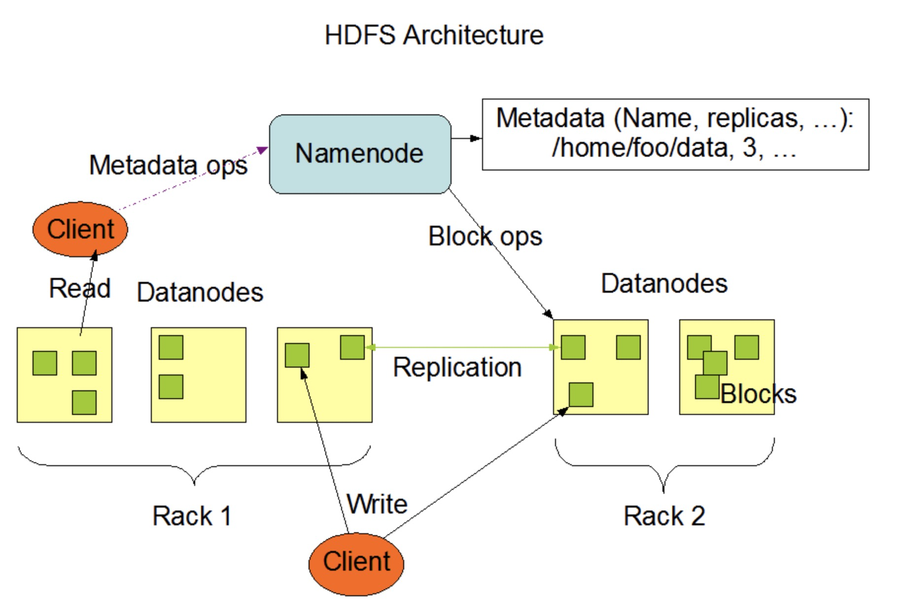
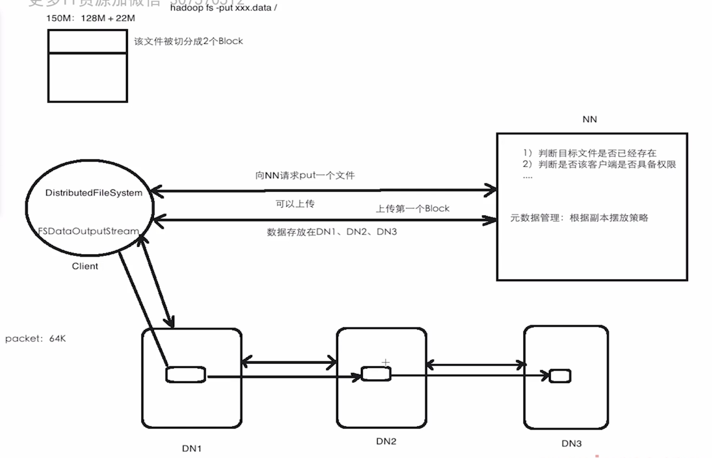
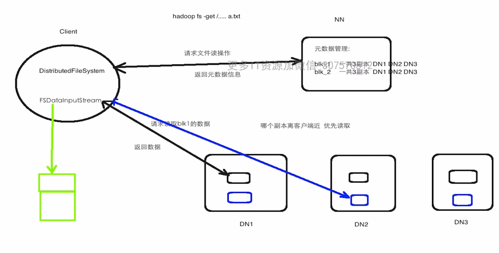
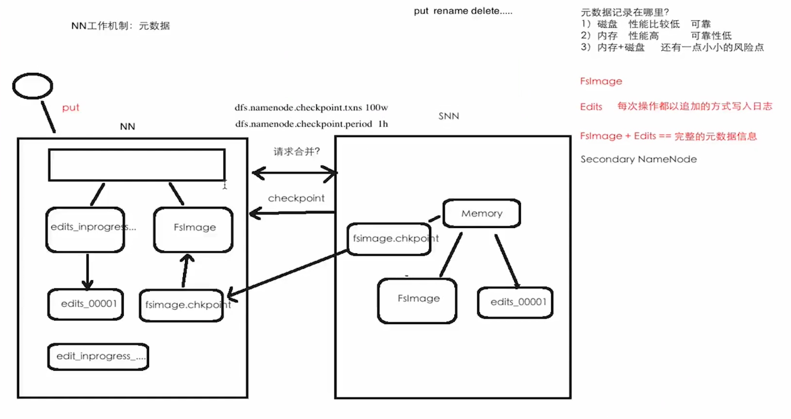
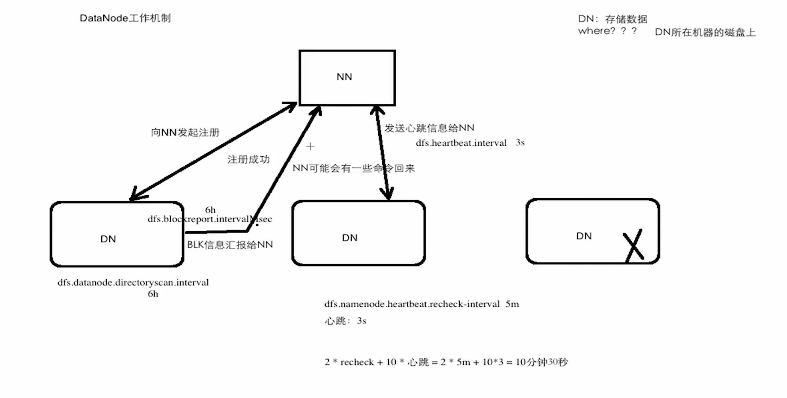

#  HDFS

HDFS是一个分布式，高容错，高吞吐量，支持流式数据传输的，可运行在廉价的硬件机器上的文件系统


## 1.假设和目标

- 硬件问题是常见的，成千上万的机器存储部分数据，这些机器都会有一定概率出现问题，导致数据问题。那么HDFS考虑的核心问题就是对于这些硬件问题进行如何检测以及自动、快速恢复。
- HDFS的流式数据访问设计的重点不是交互式的数据处理而是批处理以及离线处理，它的设计重心是高吞吐量而不是低延迟。
- 大数据集、大集群，对带宽有要求。
- 一次写入，多次读取，采用分布式计算框架等对这份数据进行多次处理，数据是被append到尾部，不能对文件的任意位置的数据进行修改。
- 移动计算优于移动数据，数据在哪里，作业调度就在哪里。
- 跨平台


## 2.架构

> NameNode（NN）：file system namespace 文件系统命名空间，执行文件系统的命名空间操作：打开、关闭、重命名等，记录数据块对应的DN，管理元数据
>
> DataNode（DN）：存储数据，负责数据读写操作，还包括块的创建、删除、副本等指令
>
> 主从架构



### 2.1 文件系统命名空间

- 常规的层级文件目录结构

- 支持定义文件存储数量

- 支持定义文件访问权限

- 不支持软、硬链接

  NameNode将记录所有文件记录以及副本系数（副本因子）


### 2.2 副本

文件被拆成块后按副本系数复制成几个副本存放于DN中，此设计目的主要基于高容错性的设计目标。DN会周期性的进行心跳和汇报块的信息给NN。


**副本摆放策略：**

一般副本系数设置成3。

- 如果客户端在集群内写入，则第一个副本写在当前节点上（本地）。客户端在集群外，则第一个副本写在随机选择一个节点上；
- 第二个副本写在集群另外一个机架上随机选择一个节点上；
- 第三个副本写在第二个副本所在机架上随机选择一个节点上。


所以，HDFS架构及各个组件职责：

​      主从架构，一个NN多个DN

​      **NN**

- 维护和管理文件系统命名空间;
- 维护和管理副本策略；
- 维护和管理数据块映射信息、
- 处理客户端读写请求

​      **DN**

- 存储数据库块信息
- 真正执行数据块的读写操作

​      **Client**

- 首先与NN交互，获取到文件的元数据信息
- 再与DN交互，执行数据块的读写操作
- 管理HDFS

​      **SNN**：Secondary NameNode，不是NN的热备，分担一些NN的工作量（定期合并FS Image和Edits等）

**数据库在3.0中默认大小为128MB**


## 3. HDFS优缺点

### 3.1 优点

- 构建在廉价的机器上
- 多副本：高容错性
- 存大数据：前提是空间够，带宽够

### 3.2 缺点

- HDFS不适合存小文件
- 仅支持append追加，不支持文件的随机修改
- 不适合低延迟的操作


## 4. HDFS单机部署

1. 官网下载

2. 上传至服务器并解压：tar -zxvf hadoop-3.3.2.tar.gz -C ~/app/

3. Hadoop-3.3.2

   1. bin：客户端脚本
   2. logs：日志
   3. sbin：服务端脚本
   4. etc：相关配置文件
   5. share：一些jar和例子等

4. 配置Hadoop

   1. 配置 etc/hadoop/hadoop-env.sh JAVA_HOME=机器上安装的java

   2. 配置NN etc/hadoop/core-site.xml

      ```xml
      <configuration>
        <property>
          <name>fs.defaultFS</name>
          <value>hdfs://localhost:9000</value>
        </property>
        <property>
          <name>hadoop.tmp.dir</name>
          <value>/home/hadoop/app/tmp/dfs332</value>
        </property>
      </configuration>
      ```

   3. 配置副本 etc/hadoop/hdfs-site.xml

      ```xml
      <configuration>
        <property>
          <name>dfs.replication</name>
          <value>1</value>
        </property>
        <!-- 云主机需要设置下项，指定使用hostname进行datanode通信，否则客户端api操作失败 -->
        <property>
          <name>dfs.datanode.use.datanode.hostname</name>
          <value>true</value>
        </property>
      </configuration>
      ```
   
   4. 配置免密码登录
   
      ```shell
      ssh-keygen -t rsa -P '' -f ~/.ssh/id_rsa
      cat ~/.ssh/id_rsa.pub >> ~/.ssh/authorized_keys
      chmod 0600 ~/.ssh/authorized_keys
      ```
   
      
   
   5. 启动
   
      1. 第一次需要格式化文件系统，只执行一次，后续再执行则数据丢失
   
         ```shell
         bin/hdfs namenode -format
         ```
   
      2. 启动HDFS
   
         ```shell
         sbin/start-dfs.sh #保证NameNode，DataNode，SencodaryNameNode都启起来
         ```


## 5. HDFS常用命令

```shell
#1.文件上传
hadoop fs -moveFromLocal 'srcFile' 'hadoop dist dir' #将本地文件移动至hadoop指定目录

hadoop fs -copyFromLocal 'srcFile' 'hadoop dist dir' #将本地文件拷贝至hadoop指定目录

hadoop fs -put 'srcFile' 'hadoop dist dir'           #等同于copyFromLocal

hadoop fs -appendToFile 'srcFile' 'hadoop dist dir'  #追加文件内容到hadoop指定文件尾部

#2.文件查看
hadoop fs -cat 'hadoop指定文件'  #注意文件大小
hadoop fs -text 'hadoop指定文件' #注意文件大小

hadoop fs -head 'hadoop指定文件' #从文件开头显示32k内容
hadoop fs -tail 'hadoop指定文件' #从文件尾部显示32k内容

#3.文件下载
hadoop fs -copyToLocal 'hadoop指定文件' '本地目录'
hadoop fs -get 'hadoop指定文件' '本地目录'

#4.其他
hadoop fs -mkdir '目录名'
hadoop fs -mkdir -p '目录名/子目录/子目录...'
hadoop fs -cp 'src' 'dist'
hadoop fs -mv 'src' 'dist'
hadoop fs -rm 'file'
hadoop fs -rm -r 'dir'
hadoop fs -chmod xxx 'dir'
hadoop fs -chown 'user':'group' 'dir or file'
hadoop fs -du -h 'dir'
hadoop fs -setrep 'num' 'file' #修改副本系数
hadoop fs -ls 'dir'


```


## 6. HDFS API

Java

Scala

入口点FileSystem

**参数优先级的问题：**

- **服务器上用命令行操作使用的是服务器上的配置 etc/hadoop/core-site.xml,etc/hadoop/hdfs-site.xml**
- **客户端没有服务端上的配置文件，默认使用的是hadoop-common.jar包内的core-default.xml中的配置**
- **所以客户端需要使用Configuration类进行设置**

### 6.1 Hadoop Maven

```xml
<dependency>
  <groupId>org.apache.hadoop</groupId>
  <artifactId>hadoop-client</artifactId>
  <version>${hadoop-version}</version>
</dependency>
```


### 6.2  FileSystem Configuration

System properties Hadoop用户固定key：HADOOP_USER_NAME

Hadoop uri key对应Hadoop etc/hadoop/core-site.xml中配置的fs.defaultFS

```java
System.setProperty("HADOOP_USER_NAME" , "服务端hadoop用户名");

Configuration config = new Configuration();
config.set("fs.defaultFS" , "hdfs://hadoop000:9000");
//配置优先级问题，设置客户端datanode用hostname通信，参考hdfs-site.xml
config.set("dfs.client.use.datanode.hostname" , "true");
//配置优先级问题，设置客户端副本系数
//如未设置，则通过fs.getConfig().get("dfs.replication")的值为null，其他配置项同理
config.set("dfs.replication" , "1");//

FileSystem fs = FileSystem.get(config);

//do sth
fs.mkdir(path);
fs.copyFromLocalFile(src , dist);//上传
fs.copyToLocalFile(src , dist);//下载
fs.rename(src , dist);//1改名，2同mv
...

//IO
FSDataOutputStream out = fs.create(path);//写文件到Hadoop
FSDataInputStream in = fs.open(path);//从Hadoop度文件

//close collection
if(null != fs) fs.close();  

```


## 7 HDFS读写过程

### 7.1写数据过程



### 7.2 读数据过程



### 7.3 NameNode工作机制

完整的元数据信息：FsImage + Edits

防止Edits日志过大导致恢复慢，所以用SecondaryNameNode来辅助NameNode，SNN周期性请求NN进行checkpoint



### 7.4 DataNode工作机制



## 8. HDFS安全模式

安全模式用于HDFS启动时保证初始化元数据信息过程

安全模式可读但不可写
