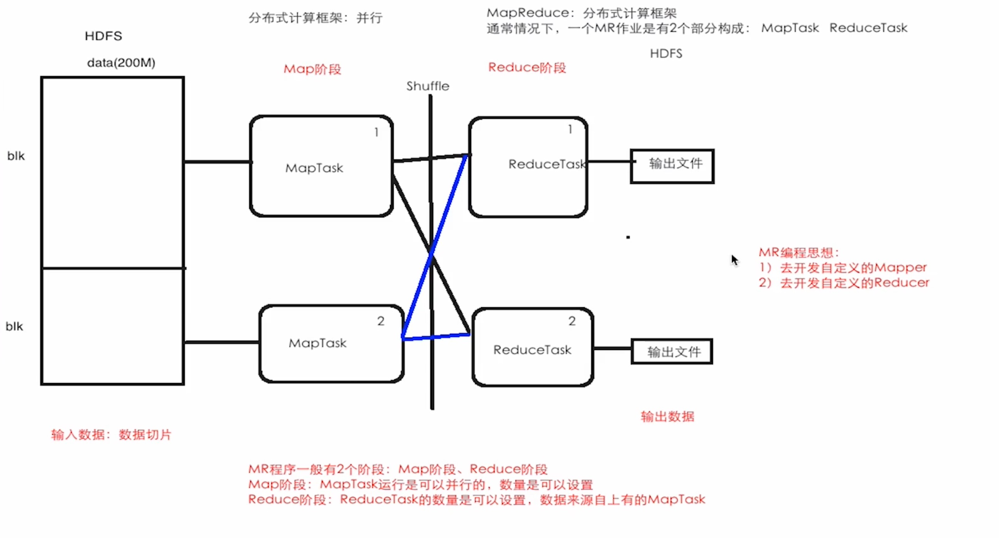
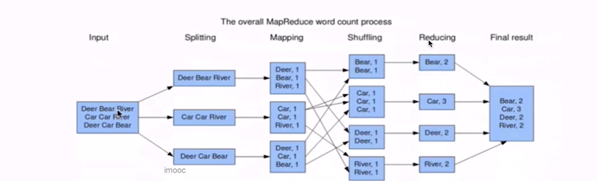

# MapReduce

## 1.MapReduce是什么

是一个分布式计算（Spark Hive Flink）框架，能够方便快捷的开发，处理大数据级别(T级别)应用，大数据分布式框架（并行），高可靠，高容错。MR封装了或者屏蔽了很多分布式开发代码的麻烦点，自带/默认的组件，按照开发规范编写业务代码.所以对于开发者而言，开发分布式作业其实是感知不到的，开发时就和写单机程序是一样的。


## 2.MR的优缺点

### 2.1优点

1. 编码角度：按照MR的核心组件规范，其实就是去实现MR提供的抽象类或者是接口
2. 扩展角度：基于计算的资源情况，HDFS分布式文件存储系统：File==>Blocks==>DNs，如果存储空间不够了，加机器就可以很方便的达到水平扩展；计算资源：（CPU ， Memory）通过加机器进行水平扩展
3. 容错角度：Node挂了，MR框架会将这个Node上的作业转移到其他节点上去运行
4. 海量数据的离线计算/批计算

### 2.2缺点

1. 不适合实时计算/流计算
2. 不适合迭代次数多的计算，job1 ==> job2 ==> job3 ==> job4


## 3.MR编程思想



MapTask:处理Map阶段流程

ReduceTask:处理Reduce阶段流程

一个MR作业运行起来：N个MapTask + N个ReduceTask

MRAppMaster:负责整个MR作业的调度/协调


> 通过官方的WordCount案例来了解MR作业
>
> WordCount：词频统计，一个非常经典的例子，求每个单词出现的次数
>
> ```java
> import java.io.IOException;
> import java.util.StringTokenizer;
> 
> import org.apache.hadoop.conf.Configuration;
> import org.apache.hadoop.fs.Path;
> import org.apache.hadoop.io.IntWritable;
> import org.apache.hadoop.io.Text;
> import org.apache.hadoop.mapreduce.Job;
> import org.apache.hadoop.mapreduce.Mapper;
> import org.apache.hadoop.mapreduce.Reducer;
> import org.apache.hadoop.mapreduce.lib.input.FileInputFormat;
> import org.apache.hadoop.mapreduce.lib.output.FileOutputFormat;
> 
> public class WordCount {
>   
>   /** 
>    * 通过Mapper先分
>    **/
>   public static class TokenizerMapper extends Mapper<Object, Text, Text, IntWritable>{
> 	  //单词计数器
>     private final static IntWritable one = new IntWritable(1);
>     //单词，对应Reducer的key
>     private Text word = new Text();
> 
>     public void map(Object key, Text value, Context context) throws IOException, InterruptedException {
>       //将每行内容进行拆分
>       StringTokenizer itr = new StringTokenizer(value.toString());
>       while (itr.hasMoreTokens()) {
>         //设置key
>         word.set(itr.nextToken());
>         //在上下文（容器）写入对应单词单个占位计数
>         context.write(word, one);
>       }
>     }
>   }
> 
>   /** 
>    * 再通过Reducer合并
>    **/
>   public static class IntSumReducer extends Reducer<Text,IntWritable,Text,IntWritable> {
>     //合并计数结果，reducer输出
>     private IntWritable result = new IntWritable();
> 
>     public void reduce(Text key, Iterable<IntWritable> values,Context context) throws IOException, InterruptedException {
>       int sum = 0;
>       //遍历Mapper中key的占位计数，并累加起来
>       for (IntWritable val : values) {
>         sum += val.get();
>       }
>       //将总数设置到结果
>       result.set(sum);
>       //在上下文（容器）输出对应单词总数
>       context.write(key, result);
>     }
>   }
>  
>   /**
>    * Driver
>    **/
>   public static void main(String[] args) throws Exception {
>     Configuration conf = new Configuration();//HDFS链接信息
>     Job job = Job.getInstance(conf, "word count");//Job实例
>     job.setJarByClass(WordCount.class);//设置Job class
>     job.setMapperClass(TokenizerMapper.class);//设置自定义Mapper class
>     job.setCombinerClass(IntSumReducer.class);//设置本地自定义Reducer class
>     job.setReducerClass(IntSumReducer.class);//设置自定义Reducer class
>     job.setOutputKeyClass(Text.class);//设置Reducer输出key类型
>     job.setOutputValueClass(IntWritable.class);//设置Reducer输出value类型
>     FileInputFormat.addInputPath(job, new Path(args[0]));//设置Job的输入数据文件(目录)
>     FileOutputFormat.setOutputPath(job, new Path(args[1]));//Job的输出数据文件(目录)
>     System.exit(job.waitForCompletion(true) ? 0 : 1);
>   }
> }
> ```
>
> 


## 4.MapReduce作业的编程规范

- 自定义的Mapper
  - extends Mapper<Object , Text , Text , IntWritable>（MR框架提供的核心组件）
    - 1,2泛型Object ， Text：Mapper的输入数据key的类型 ， 输入数据value的类型
    - 3,4泛型Text ， IntWritable：Mapper的输出数据key的类型，输出数据的value的类型
  - 重写map方法：自己的业务逻辑
- 自定义的Reducer
  - extends Reducer<Text, IntWritable, Text, IntWritable> （MR框架提供的核心组件）
    - 1,2泛型Text, IntWritable: Reducer的输入数据key的类型（对应Mapper的输出数据key的类型），输入数据的value的类型（对应Mapper的输出数据value的类型）
    - 3,4泛型Text, IntWritable: Reducer的输出数据key的类型，输出数据的value的类型
  - 重写reduce方法：自己的业务逻辑
- 自定义的Driver
  - 通过Driver把整个MR作业串起来
    - 获取Job
    - 设置Job class
    - 设置自定义的Mapper class
    - 设置自定义的Reducer class
    - 设置自定义的Mapper输出的key，value类型
    - 设置自定义的Reducer输出的key，value类型
    - Job提交并等待结束

在MR编程中会有Mapper，Reducer的输入输出key，value的类型，如Text，IntWritable，它们是Hadoop提供的序列化类型，

在Hadoop中KEY和VALUE都是要实现Writable接口，如果KEY要支持排序，那么需要实现WritableComparable接口

自定义序列化：

1. 实现Writable接口
2. 默认无参构造方法
3. 重写write()和readFields()，注意顺序问题
4. 按需重写toString()

KV类型都需要实现Writable接口，如果K需要排序则实现WritableComparable接口。

| Java中的数据类型 | Hadoop的序列化类型（Writable） |
| ---------------- | ------------------------------ |
| String           | Text                           |
| Int              | IntWritable                    |
| Long             | LongWritable                   |
| Double           | DoubleWritable                 |
| Float            | FloatWritable                  |
| Short            | ShortWritable                  |
| Byte             | ByteWritable                   |
| Boolean          | BooleanWritable                |
| Null             | NullWritable                   |

Hadoop中序列化特点：

1. 紧凑
2. 速度
3. 扩展性
4. 互操作


Mapper ， Reducer源码：

模版模式，MR基于文件数量创建Task，Reducer task顺序默认是字典序

生命周期：

run()定义执行模板

setup();初始化操作

map();

cleanup();资源释放操作


InputFormat:

- HDFS：是以Block为单位进行存储
- MR：是以InputSplit为单位的，是一个逻辑概念，InputSplit是交给MapTask来运行的
- 数据进入流程：InputFormat ==> Mapper ==>Shuffle ==> Reducer ==> OutputFormat
- 需要重点关注InputSplit与Mapper的关系
  - 一个MR作业，Mapper阶段的并行度是由InputSplit（切片）个数决定的
  - 当文件很小时，一个文件对应一个InputSplit，对应一个MapTask
  - 具体分片数量要看客户端具体block size，比如服务端默认128M，本地默认32M，则分片数量按32M来分


FIleInputFormat的主要子类

- KeyValueTextInputFormat
- NLineInputFormat，按照行数进行切片，不会根据block size进行切片
- TextInputFormat

