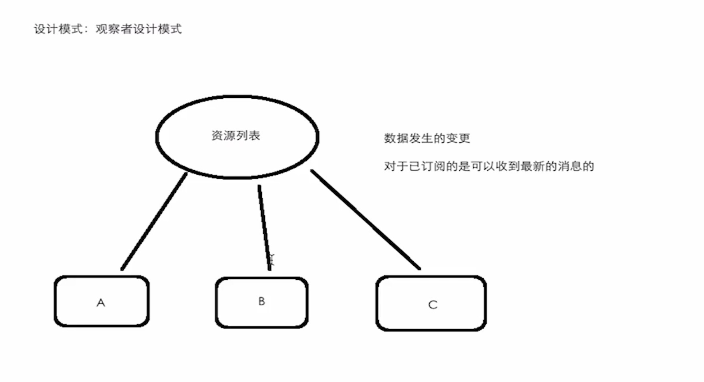
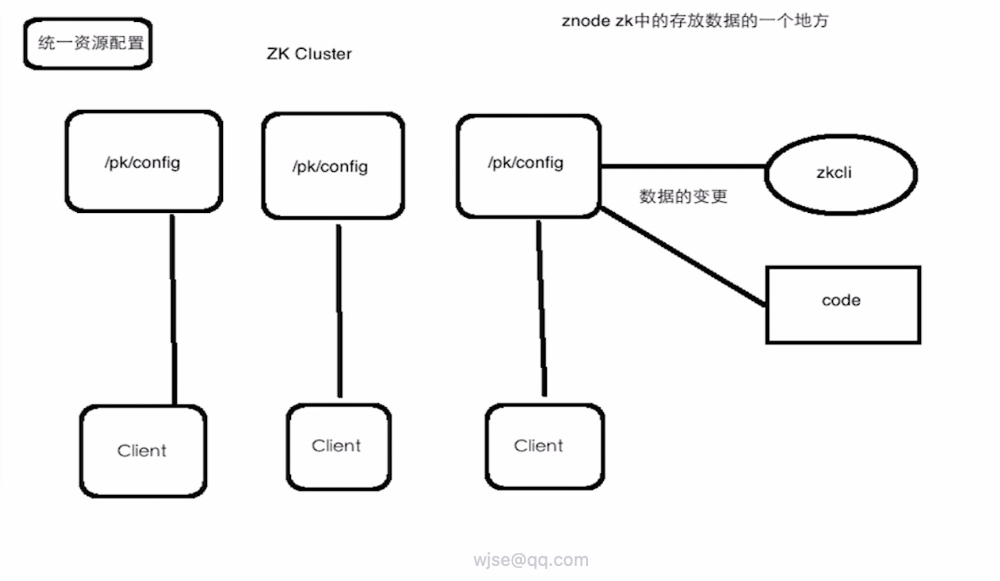
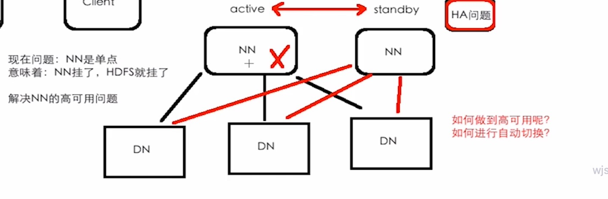

# Zookeeper

## 1. 概念




Leader:领导者

Follower:跟随者

**集群中只要有一半以上的节点存活，那么ZK集群就可以提供正常服务**

所以ZK集群配置基数个

全局数据一致性：每个Server都有一份数据副本，这样才能保证任意Client链接到任意Server，数据一致性

数据原子性：任意一个Client对数据做出了改变，要么成功，要么失败

服务挂掉将进行选举机制，当server >= 总server一半以上，那么最后那个server则被选举为leader


## 2.使用场景

- 统一资源配置



- HA问题

  

## 3. 数据模型

- ZK的基本数据模型是一个层次化的目录数据（树形结构）

- ZK中每个节点：znode，唯一的路径标识

- znode有两种类型：1、临时的ephemeral，客户端会话结束后，该类型的节点就会被删除。该类型节点下是不能有子节点

​                                         2、永久的persistent，只要创建，一直存在

​                                         3、顺序节点：SEQUENTIAL自动编号（永久节点下）

​	    在创建时，一但确定了节点类型，就不能修改

- znode的特点：
  - znode的数据都有各自的版本号，我们可以通过代码或命令行来显示
  - 节点数据发生变化，该节点的版本号会增加，乐观锁
  - znode上存放的数据不宜过大
  - znode可以设置ACL（权限）
  - 对znode可以设置watcher（监听器）

### 3.1 watcher

针对每个znode的操作，可以设置监听器

当监控的某个znode发生了变化，则会触发watcher事件

zk中的watcher是一次性的，触发后立即销毁（终端中）

父子节点之间也可以进行监听


NodeCreated

NodeDeleted

NodeDataChanged


NodeChildrenChanged


### 3.2 四字命令

在配置中开启白名单

4lw.commands.whitelist=*

执行命令

```shell
echo ruok | nc localhost:2181
```


## 4. 集群

集群中的主要概念：

- 主从节点：
  - HDFS：NN(active standby)    DN
  - YARN:   RM(active standby)    NM   
- 心跳机制
- 选举模式
  - 一般情况都是奇数个


集群配置

修改数据目录

修改端口号

添加server

server.1=ip:通信端口:选举端口

到data目录创建myid文件，内容对应配置的server."myid"