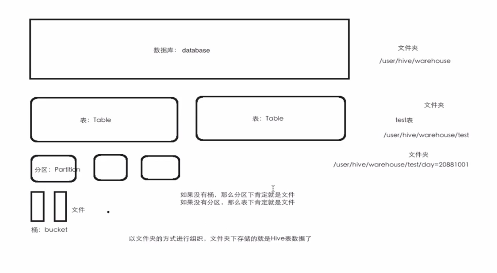
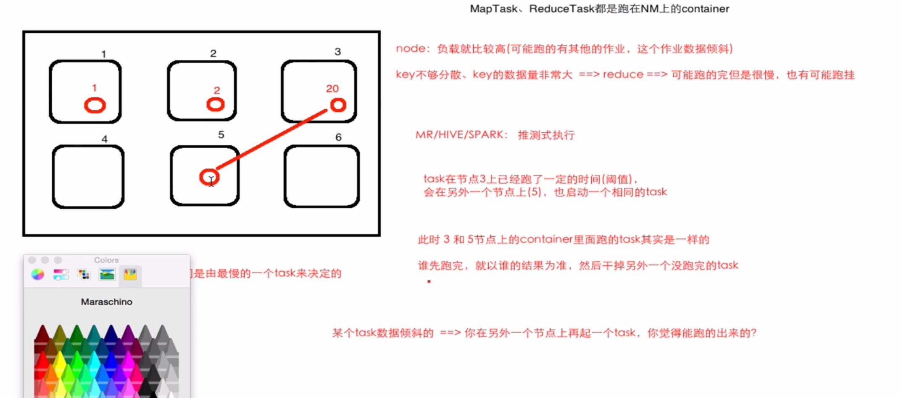

# Hive

## 1.概念

使用SQL来进行读、写等操作大数据集的分布式数据仓库，由Facebook开源，为了解决海量结构化的日志数据统计问题，Hive构建在Hadoop之上的数据仓库，

Hadoop:

​    HDFS: Hive的数据可以存放在HDFS之上

​    MR:     分布式执行引擎，HIve的作业是可以以MR的方式运行（Hive底层支持多种不同的执行引擎，只要一个参数切换即可）

​    YARN: 统一的资源管理和调度；

Hive定义了一种类SQL的语言：Hive QL(HQL)；

Hive将SQL翻译成底层引擎对应的作业，并提交运行；

Hive支持压缩、存储格式、自定义函数

适用于批计算/离线计算


## 2.Hive优缺点

优点：

1. 类SQL，受众面大，易上手
2. 比MR编程简单
3. 内置了非常多的函数，即使不够，也可以自定义UDF函数

缺点：

1. SQL的表述能力有限
2. 作业的延迟比较大，不适合实时作业
3. 处理少量数据可能也会花费比较多的时间


## 3.Hive架构


- 访问方式：
  - CLI：命令行
  - JDBC/ODBC：代码，需要HiveServer2
  - Web UI：HUE Zeppelin，需要HiveServer2

- Driver:
  - 解析器：SQL（String）==> AST（抽象语法树）
  - 编译器：AST ==> 逻辑执行计划
  - 优化器：逻辑执行计划进行优化
  - 执行器：执行计划 ==> 底层引擎的作业（MR/Tez/Spark）
- MetaStore:  
  - 数据表元数据，表结构


## 4.Hive vs RDBMS

- 面向SQL
- 时效性
  - Hive:统计分析，批/离线计算，延时性较高
  - RDBMS: 数据/统计查询，实时快速的拿到结果，延时性短
- 事务
  - Hive:支持(版本要求，0.14版本)
  - RDBMS:支持
- insert/update/delete操作
  - Hive:支持(版本要求，0.14版本)
  - RDBMS:支持
- 分布式
  - Hive:MR Tez Spark,扩节点，上万节点，廉价机器
  - RDBMS:支持，几十个，专用机器
- 数据量
  - Hive: PB
  - RDBMS: <PB
  - 

## 5.Hive部署

创建$HIVE_HOME/conf/hive-site.xml文件

```xml
<?xml version="1.0" encoding="UTF-8" standalone="no"?>
<?xml-stylesheet type="text/xsl" href="configuration.xsl"?>
<configuration>
  <property>
    <name>javax.jdo.option.ConnectionURL</name>
    <value>jdbc:mysql://localhost:3306/hive?createDatabaseIfNotExist=true&amp;useSSL=false&amp;useUnicode=true</value>
    <description>
			元数据数据库url
    </description>
  </property>
  <property>
    <name>javax.jdo.option.ConnectionDriverName</name>
    <value>com.mysql.jdbc.Driver</value>
  </property>
  <property>
    <name>javax.jdo.option.ConnectionUserName</name>
    <value>root</value>
  </property>
  <property>
    <name>javax.jdo.option.ConnectionPassword</name>
    <value>xxxxxx</value>
  </property>
</configuration>
```


拷贝对应数据库驱动Jar至$HIVE_HOME/lib目录下

首先执行schematool，初始化元数据库

```shell
$HIVE_HOME/bin/schematool -dbType mysql -initSchema
```

启动hive，需要先启动Hadoop和Yarn等

```shell
$HIVE_HOME/bin/hive
```


Hive中有一个默认的数据库 default

注意：将$HIVE_HOME/lib/log4j-slf4j-impl-2.10.0.jar改名，使其不起作用，以免和hadoop的log4j冲突


## 6.Hive参数设置

官网Hive Configuration Properties

Hive中参数的设置

set key;查看key的值

set key=value;设置key的值

这种方式只对当前session有效


全景设置在$HIVE_HOME/conf/hive-site.xml

```xml
<property>
  <name>key</name>
  <value>value</value>
</property>
```


还可以在启动命令的时候进行设置

```shell
$HIVE_HOME/bin/hive --hiveconf xxx=xxx
```

设置优先级session > 启动命令 > 配置文件

简单参数：

| 项                           | 说明                                                     |
| ---------------------------- | -------------------------------------------------------- |
| hive.execution.engine        | 引擎选择，默认MR，2.0版本后MR已过时                      |
| hive.cli.print.header        | 标列名显示，默认false，一般需要设置为true                |
| hive.cli.print.current.db    | 当前库是否显示，默认false                                |
| hive.metastore.warehouse.dir | Hive数仓默认在HDFS上的存储路径，默认/user/hive/warehouse |


## 7.Hive交互式命令

最常用的

```shell
hive -e "select * from test"
hive -f "test.sql"
```


## 8.DDL & DML

### 8.1数据模型



### 8.2DDL之数据库

- CREATE

```hive

CREATE [REMOTE] (DATABASE|SCHEMA) [IF NOT EXISTS] database_name
  [COMMENT database_comment]
  [LOCATION hdfs_path]
  [MANAGEDLOCATION hdfs_path]
  [WITH DBPROPERTIES (property_name=property_value, ...)];

--例子
CREATE DATABASE IF NOT EXISTS test_1
COMMENT 'this is hive table'
LOCATION /mytable/test
WITH DBPROPERTIES ('creator'='wj' , 'date'='20231016')
```

在HDFS上的路径：

default: /user/hive/warehouse

自己创建的数据库：/user/hive/warehouse/db_name.db


- DROP

  ```hive
  DROP (DATABASE|SCHEMA) [IF EXISTS] database_name 
  [RESTRICT|CASCADE]; --CASCADE 级联删除
  ```

- ALTER

  ```hive
  ALTER (DATABASE|SCHEMA) database_name SET DBPROPERTIES (property_name=property_value, ...);   -- (Note: SCHEMA added in Hive 0.14.0)
   
  ALTER (DATABASE|SCHEMA) database_name SET OWNER [USER|ROLE] user_or_role;   -- (Note: Hive 0.13.0 and later; SCHEMA added in Hive 0.14.0)
    
  ALTER (DATABASE|SCHEMA) database_name SET LOCATION hdfs_path; -- (Note: Hive 2.2.1, 2.4.0 and later)
   
  ALTER (DATABASE|SCHEMA) database_name SET MANAGEDLOCATION hdfs_path; -- (Note: Hive 4.0.0 and later)
  ```

  

### 8.3DDL之表

- CREATE

  ```hive
  CREATE TABLE xxx IF NOT EXISTS
  [EXTERNAL] --外部表
  [(col_name data_type , ...)]
  [COMMENT]
  [PARTITIONED BY] --指定分区
  [CLUSTERED BY]
  [SKEWED BY]
  [SORTED BY]
  [ROW FORMAT]
  	DELIMITED FIELDS TERMINATED BY ',' --按,分隔
  [STORED AS] -- 以什么格式存储
  	textfile
  	...
  [LOCATION] --HDFS路径
  [LIKE] --复制表结构，不复制数据
  [AS select ... from table_name] --复制表结构和数据
  ```

- UPDATE

  ```hive
  ALTER TABLE table_name RENAME to new_table_name; --修改表名，HDFS文件并不会改名
  
  ALTER TABLE table_name ADD COLUMNS (col_name col_data_type) --添加新列
  
  ALTER TABLE table_name CHANGE COLUMN old_col_name new_col_name new_col_data_type; --修改列
  
  ALTER TABLE table_name REPLACE COLUMNS (col_name col_data_type,...) --重替换列
  ```

- DROP/TRUNCATE

  ```hive
  DROP TABLE IF EXISTS table_name;
  TRUNCATE TABLE table_name; --元数据还在
  ```

  

### 8.4内部表 vs 外部表

```hive
desc format table_name; --查看表说明
```


创建外部表，用关键字EXTERNAL，不加默认为内部表

内部表：MANAGED_TABLE，受Hive管控的表，在drop时它的数据和元数据都会被删除

外部表：EXTERNAL_TABLE，在drop时元数据会被删除，但数据还在HDFS上，安全性较高


```hive
ALTER table_name SET TBLPROPERTIES ('EXTERNAL'='TRUE') --将内部表转为外部表 , EXTERNAL必须大写
ALTER table_name SET TBLPROPERTIES ('EXTERNAL'='FALSE') --将外部表转为内部表 , EXTERNAL必须大写
```

默认Hive创建内部表，实际项目上为了安全起见，大部分表使用外部表，只有某些关联表如数仓分层之间的表用内部表，具体看项目需求

### 8.5加载数据方式

- LOAD

  ```hive
  LOAD DATA [LOCAL] INPATH 'file_path' [OVERWRITE] INTO TABLE table_name [PARTITION (k=v, ...)]
  -- LOCAL 本地文件，否则从HDFS加载
  -- OVERWRITE 覆盖，否则追加
  -- PARTITION 分区信息
  ```

  还可以通过CTAS方式

  ```hive
  CREATE TABLE table_name AS SELECT cols FROM t_table --表不能事先存在
  ```

- INSERT

  ```hive
  INSERT OVERWRITE TABLE table_name [PARTITION (k=v, ...) [IF NOT EXISTS]] SELECT cols FROM a_table [WHERE]; --覆盖
  FROM a_table INSERT OVERWRITE TABLE table_name [PARTITION (k=v, ...) [IF NOT EXISTS]] SELECT cols [WHERE] 
  --注意字段类型、个数、顺序须相同
  --表必须事先存在
  INSERT INTO TABLE table_name [PARTITION (k=v, ...)] SELECT cols FROM a_table; --追加
  
  
  ```

  不推荐使用

  ```hive
  INSERT INTO table_name VALUES (v1,...)
  ```

  因为在HDFS上会多出一个00000_x的小文件

​		写入到目录，可通过HDFS get、put命令来简化

        ```hive
        --LOCAL写到本地 , 否则写到HDFS上
        INSERT OVERWRITE [LOCAL] DIRECTORY dir
          [ROW FORMAT row_format] [STORED AS file_format] (Note: Only available starting with Hive 0.11.0)
          SELECT ... FROM ...


​          
​        ```

也可通过管道符写到文件：hive -e "select * from a_table" | grep > file_name


- IMPORT/EXPORT

  用于集群环境迁移

  ```hive
  --导出表数据和元数据信息
  EXPORT TABLE tablename [PARTITION (part_column="value"[, ...])]
    TO 'export_target_path' [ FOR replication('eventid') ]
    
  --导入，可自动创建表，表结构来源于导出的元数据信息
  IMPORT [[EXTERNAL] TABLE new_or_original_tablename [PARTITION (part_column="value"[, ...])]]
    FROM 'source_path'
    [LOCATION 'import_target_path'] 
  ```

- TRUNCATE

  只能对内部表进行操作，外部表无法操作

### 8.6分区表

- Hive中的分区对应的是HDFS上的一个文件夹，分区表的思想：把一个大的数据集，按照分区的条件分割成更小的数据集，在扫描时减少扫描的数据量，进而提升统计分析作业的性能。分区字段在HDFS上作文目录名存在

- 查询时加分区条件，否则全扫描

- 如果直接按照分区方式在HDFS上放置数据，那么分区查询该分区会失效，因为并没有加入到元数据表PARTITIONS，通过HQL LOAD数据是会刷新元数据表。通过hive命令

```shell
msck repair table 分区表名;
```

​		刷新分区元数据表

- 分区层级一般到3层就够用了，太多层级会导致NN性能压力
- 分区字段不能与普通字段重名


1. 静态分区

   ```hive
   PARTITIONED BY (col_name data_type [COMMENT comments] , ...)
   ```

   查看分区

   ```hive
   SHOW PARTITIONS 分区表
   ```

   删除某一分区

   ```hive
   ALTER TABLE 分区表 DROP PARTITION(分区字段=字段值)
   ```

   写入分区

   ```hive
   INSERT OVERWRITE TABLE 分区表 PARTITION(分区字段=字段值) SELECT cols FROM a_table [WHERE]
   ```

   

2. 动态分区

   严格模式下可能会报错，需要配置关闭严格模式

   ```shell
   set hive.exec.dynamic.partition=true ##0.9.0版本后支持
   set hive.exec.dynamic.partition.mode=nonstrict ##默认严格模式strict，关闭严格模式，严格模式用户必须指定一个分区
   set hive.exec.max.dynamic.partitions=1000 ##默认1000，最大分区个数
   set hive.exec.max.dynamic.partitions.pernode=100 ##默认100，每个节点支持的最大动态分区个数
   set hive.exec.max.created.files=10000 ##默认10000，每个作业可以创建最大文件个数
   set hive.exec.default.partitions.name=__HIVE_DEFAULT_PARTITION__ ##默认分区名字
   ```

   

   ```hive
   INSERT OVERWRITE TABLE 分区表 PARTITION(分区字段) SELECT cols,分区字段 FROM a_table
   ```

   

### 8.7 HQL查询

```hive

[WITH CommonTableExpression (, CommonTableExpression)*]    (Note: Only available starting with Hive 0.13.0)
SELECT [ALL | DISTINCT] select_expr, select_expr, ...
  FROM table_reference
  [WHERE where_condition]
  [GROUP BY col_list]
  [ORDER BY col_list]
  [CLUSTER BY col_list
    | [DISTRIBUTE BY col_list] [SORT BY col_list]
  ]
 [LIMIT [offset,] rows]
```

- 聚合函数会跑MR作业

- 分组函数会跑MR作业

- Join会跑MR作业

  ```shell
  set hive.exec.mode.local.auto=true ##开启本地模式，提升测试SQL执行效率
  ```


## 9.函数

内置函数build-in

```hive
show functions; --查看所有内置函数
desc function xxx; --查看内置函数描述信息
desc function extended xxx; --内置函数例子
```

explode炸裂


自定义函数

UDF - User Defined Function , 一进一出

UDAF - User Defined Aggregation Function , 多进一出

UDTF - User Defined Table-Generating Founction , 一进多出


Java自定义函数，maven添加依赖

```xml
<dependency>
    <groupId>org.apache.hive</groupId>
    <artifactId>hive-exec</artifactId>
    <version>3.1.2</version>
</dependency>
```

开发UDF步骤：

临时函数

1. 继承UDF(已过时)类或GenericUDF类
2. 重写evaluate方法
3. 编译打包，上传jar到服务器上
4. 在hive中执行add jar 'path' 把jar包加入到hive运行环境中
5. 创建临时函数CREATE TEMPORARY FUNCTION fun_name AS "jar_class_path"，临时函数只针对当前session
6. 在$HIVE_HOME目录创建指定目录auxlib，把jar包放进去，再重启hive
7. 创建hive初始化脚本hive-init-xxx.sql，然后启动hive -i hive-init-xxx.sql，就可相对方便的使用自定义函数


永久函数

1. 上次jar包至HDFS指定路径中
2. 在hive中执行CREATE FUNCTION fun_name AS "jar_class_path" USING JAR "hdfs://xxxx/xxx/xxx.jar";
3. hive会将以上jar信息注册到元数据FUNCS表中


窗口分析函数

显示要聚会的数据和聚合后的数据

```hive
SELECT col1,col2,col3
       SUM(col3) OVER (
         PARTITION BY col1 ORDER BY col2
         ROWS BETWEEN UNBOUNDED PRECEDING AND CURRENT ROW -- 第一行到当前行
       ) sum_t1,
       SUM(col3) OVER (
         PARTITION BY col1 ORDER BY col2
         ROWS BETWEEN 3 AND CURRENT ROW --第三行到当前行
       ) sum_t2,
       SUM(col3) OVER (
         PARTITION BY col1 ORDER BY col2
         ROWS BETWEEN 3 AND 1 FOLLOWING --第三行到往下一行
       ) sum_t3,
       SUM(col3) OVER (
         PARTITION BY col1 ORDER BY col2
         ROWS BETWEEN CURRENT ROW AND UNBOUNDED FOLLOWING --当前行到最后一行
       ) sum_t3
FROM table_name;

+--------+--------+--------+--------+
| col1   |  col2  |   col3 |  sum_t |
+--------+--------+--------+--------+
| xxxx   |  xxxx  |   xxxx |  12    |
+--------+--------+--------+--------+
```

ROW_NUMBER()从1开始，按照顺序，生成分组内记录的编号

RANK()分组内生成编号，排序相同时会重复，总数不会变，排名相同时会留有空位

DENSE_RANK()分组内生成编号，排序相同时会重复，总数会变少，排名相同时不会留有空位

NTILE(n) 函数，分组后将数据切成n片，如果数据不均匀，默认增加在前面的分片中


LAG(col , n , default_value) 用于统计窗口内往上取第n条数据，没有则为default_value

LEAD(col , n , default_value)用于统计窗口内往下取第n条数据，没有则为default_value

CUME_DIST()小于等于当前行值的行数/分组内总行数

PERCENT_RANK()（分组内当前行的RANK编号 - 1） /（ 分组内总行数 - 1）


## 10.调优

### 10.1参数配置

任务策略

```properties
hive.fetch.task.conversion=none|minimal|more  #默认more
#none即使最简单的查询也会跑MR作业
#minimal SELECT *，WHERE 过滤条件在分区字段的，LIMIT 不会跑MR作业
#more SELECT , WHERE过滤条件，LIMIT 不会跑MR作业
```


本地模式

```properties
hive.exec.mode.local.auto=true   #默认false
#是否本地执行（local hadoop）

hive.exec.model.local.auto.inputbytes.max=134217728  #默认128M
#当hive.exec.mode.local.auto，执行的数据应小于该配置数，超过该数据量会集群执行

hive.exec.model.local.auto.tasks.max=4  #默认4个
#当hive.exec.mode.local.auto，执行的任务应小于该配置数，超过该数据量会集群执行

hive.exec.model.local.auto.input.files.max=4  #默认4哥
#当hive.exec.mode.local.auto，执行的文件数应小于该配置数，超过该数据量会集群执行
```


MR模式

```properties
hive.mapred.mode=strict  #严格模式
#严格模式会禁止危险操作，
#如无limit的order by , 笛卡尔积，分区表全扫描等

#严格模式下是否检测order by带有limit
hive.strict.checks.orderby.no.limit=true
```


四大by

**order by**

​	全局排序，

​    只能有一个reducetask来完成，无论是否设置reduce个数。大数据量慎用

​    与严格模式有关系

**sort by**

​     分区内有序，

​     可以设置多个reducetask来完成，只保证每个reduce出来的结果有序

​     与严格模式无关系

**distribute by**

​      类似于partition分区，

​      控制Map端如何分发数据到reduce端，按照hash + 取余分发

**cluster by**

​       = distribute by xxx sort by xxx 是distribute by + sort by的简写

​       不支持desc

  

Hive如何高效的全局排序

distribute by + sort by +order by

```hive
SELECT * FROM (
SELECT * FROM emp DISTRIBUTE BY deptno SORT BY sal
) t
ORDER BY t.sal DESC;
```


并行执行

一个hql可能会被翻译成多个MR作业

多个MR作业之间并不是相互依赖的，如果集群资源够的话，可以开启并行执行

```properties
hive.exec.parallel=true  #默认false
hive.exec.parallel.thread.number=8 #默认8，并行线程数
```


推测式执行

```properties
hive.mapred.reduce.tasks.speculative.execution=true #默认true
```




关于MapTask数量的合理设置问题

​       FileInputFormat  ==>  780M文件按128M切片会切成7个MapTask

​       所以影响MapTask个数的因素：总文件数、文件大小、block大小

​       并不是越多越好，MapTask或ReduceTask都是以JVM进程的方式运行的，每一个都会产生JVM内存开销

​       所以需要根据实际业务情况来定最大切片大小来定MapTask数量

```properties
mapreduce.input.fileinputformat.split.maxsize=256000000  #默认256000000b
```


关于ReduceTask数量的合理设置问题

```properties
hive.exec.reducers.bytes.per.reducer=256000000  #每个reducer处理文件大小，默认256000000b
hive.exec.reducers.max=<number> #

mapreduce.job.reduces=<number>   #
```

根据作业数据量，作业结果有多小，再反推来设置reduce个数


### 10.2 数据倾斜

产生的原因：某个或某几个key的数据过大或过于集中，相同的key是在一个ReduceTask中运行的，运行时间会比较长或可能Task无法执行完成。

MapTask join时不会产生数据倾斜，只有在Reduce端产生（shuffle），比如group by ，count(distinct col)的时候

```properties
hive.groupby.skewindata=true   #设置groupby优化，底层为先打散后聚合
```

一般不用count(distinct)，由select count(1) from (select col from t group by col) 代替。

MapTask join不产生数据倾斜是因为默认配置

```properties
hive.auto.convert.join=true    #设置map join转换
```

该配置将本来有Reduce Task执行的join步骤，转换由Loca Map Task执行，将小表数据进行缓存，在Map端进行join，下面配置设置小表文件大小

```properties
hive.smalltable.filesize=25000000    #默认25M
#或
hive.mapjoin.smalltable.filezise=25000000  #0.8.1版本后替代
```

谁是小表，是在hive元数据表中有记录，所以hive指导谁是小表


如何避免数据倾斜？

**先打散后聚合**

以WordCount为例：

Map                                打散

​      <word,1>                 <随机数_word,1>

Reduce                          

​      累加          算一次

​                                        再进行Map

​                                                   <随机数_word, cnt>     去掉随机数

​                                        再进行Reduce

​                                                    累加聚合
