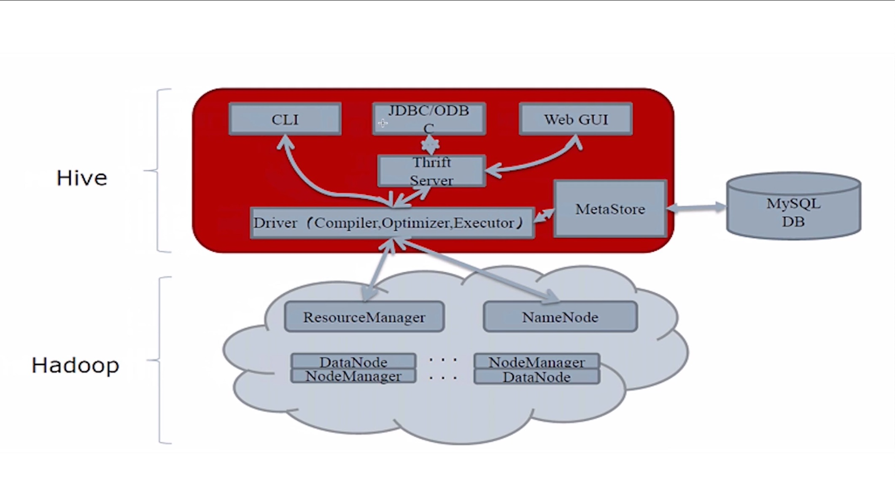

# Hive

## 1.概念

使用SQL来进行读、写等操作大数据集的分布式数据仓库，由Facebook开源，为了解决海量结构化的日志数据统计问题，Hive构建在Hadoop之上的数据仓库，

Hadoop:

​    HDFS: Hive的数据可以存放在HDFS之上

​    MR:     分布式执行引擎，HIve的作业是可以以MR的方式运行（Hive底层支持多种不同的执行引擎，只要一个参数切换即可）

​    YARN: 统一的资源管理和调度；

Hive定义了一种类SQL的语言：Hive QL(HQL)；

Hive将SQL翻译成底层引擎对应的作业，并提交运行；

Hive支持压缩、存储格式、自定义函数

适用于批计算/离线计算

## 2.Hive优缺点

优点：

1. 类SQL，受众面大，易上手
2. 比MR编程简单
3. 内置了非常多的函数，即使不够，也可以自定义UDF函数

缺点：

1. SQL的表述能力有限
2. 作业的延迟比较大，不适合实时作业
3. 处理少量数据可能也会花费比较多的时间

## 3.Hive架构

- 访问方式：
  - CLI：命令行
  - JDBC/ODBC：代码，需要HiveServer2
  - Web UI：HUE Zeppelin，需要HiveServer2

- Driver:
  - 解析器：SQL（String）==> AST（抽象语法树）
  - 编译器：AST ==> 逻辑执行计划
  - 优化器：逻辑执行计划进行优化
  - 执行器：执行计划 ==> 底层引擎的作业（MR/Tez/Spark）
- MetaStore:  
  - 数据表元数据，表结构