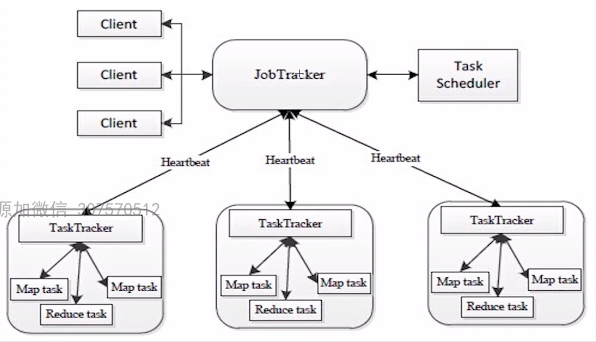
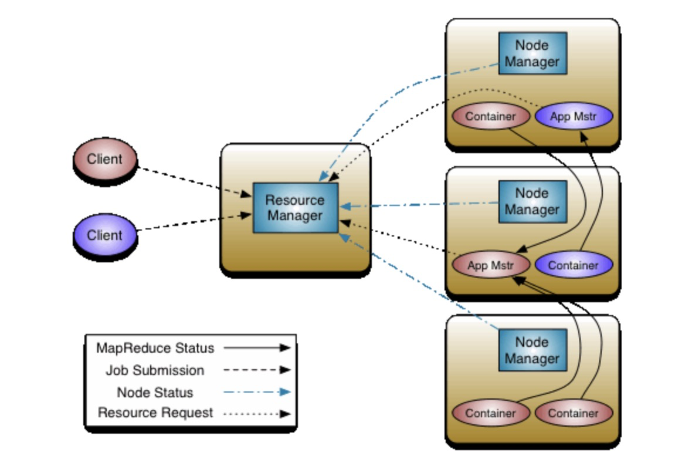

# YARN

## 1.YARN产生背景

Hadoop1.0



- JobTracker，负责资源管理和作业调度，单JobTracker存在**单点故障**，非高可用；JobTracker容易成为性能瓶颈，非高性能；只能跑MR作业；
- TaskTracker，定期向JobTracker汇报本节点的健康状况，资源使用状况，Task的执行情况，接受JobTracker的命令

所以在Hadoop 2.x的时候推出YARN


## 2.YARN工作机制

YARN将资源管理功能和作业监控以及作业调度拆分成独立的进程

- RM，Resource manager，
  - 全局资源管理器；
  - 整个集群同一个时间点只有一个是active的（高可用），负责集群资源的统一管理和调度
  - 启动和监控AM，如果某个AM挂掉，RM将在另一个NM上启动该AM（容错性）
  - 监控NM，接受NM心跳信息，如果某NM挂掉，将挂掉的NM上的作业交由AM处理
- NM，Node manager
  - 这个集群中有多个，负责该节点机器上的资源和使用
  - 周期性向RM汇报本节点上的资源使用情况，已经Container的运行状态
  - 接受并处理来自于RM关于Container的启停命令
  - 处理来自AM的命令
- AM，Application manager，每个应用单独的资源管理器
  - 数据切分
  - 为应用程序向RM申请资源（Container），分配任务
  - 于NM通信：启停Container
  - 任务容错
  - 处理RM发过来的命令
- Container
  - 任务运行环境的抽象容器（任务运行资源：节点、内存、CPU）
  - 任务启动命令
  - YARN所有的任务都是运行在Container中的，AM、MT/RT、都是运行在其中
- Client，提交作业、杀死作业的客户端



1. Client向YARN中提交应用：Jar，配置文件等
2. RM为该应用分配第一个Container
3. RM需要与NM通信，要求该NM中的这个Container运行AM
4. AM向RM注册，Client可以通过RM查询该应用运行状态；AM为该应用到RM上去申请资源（MT/RT等）
5. 根据RM申请的资源在集群中各NM中执行Task任务


## 3.YARN容错性

- RM
  - RM通过Zookeeper来实现高可用，避免单点问题
- NM
  - 执行失败后，RM将失败的任务高度对应的AM，由AM去决定如何处理失败的任务
- AM
  - 执行失败后，由RM负责重启


## 4.YARN单节点部署

- 配置mapred-site.xml

```xml
<configuration>
    <property>
        <name>mapreduce.framework.name</name>
        <value>yarn</value>
    </property>
    <property>
        <name>mapreduce.application.classpath</name>
        <value>$HADOOP_MAPRED_HOME/share/hadoop/mapreduce/*:$HADOOP_MAPRED_HOME/share/hadoop/mapreduce/lib/*</value>
    </property>
</configuration>
```

- 配置yarn-site.xml

```xml
<configuration>
    <property>
        <name>yarn.nodemanager.aux-services</name>
        <value>mapreduce_shuffle</value>
    </property>
    <property>
        <name>yarn.nodemanager.env-whitelist</name>
        <value>JAVA_HOME,HADOOP_COMMON_HOME,HADOOP_HDFS_HOME,HADOOP_CONF_DIR,CLASSPATH_PREPEND_DISTCACHE,HADOOP_YARN_HOME,HADOOP_HOME,PATH,LANG,TZ,HADOOP_MAPRED_HOME</value>
    </property>
</configuration>
```

- 启动脚本start-yarn.sh
- 配置YARN历史服务器，mapred-site.xml

```xml
<configuration>
    <!-- 服务端 -->
    <property>
        <name>mapreduce.jobhistory.address</name>
        <value>xxxx:10020</value>
    </property>
    <!-- web端 --> 
    <property>
        <name>mapreduce.jobhistory.webapp.address</name>
        <value>xxxx:100201</value>
    </property>
</configuration>
```

- 配置yarn-site.xml开启日志聚集功能

```xml
<configuration>
    <!-- 开启日志聚集功能 -->
    <property>
        <name>yarn.log-aggregation-enable</name>
        <value>true</value>
    </property>
    <!-- 设置日志聚集服务器地址 -->
    <property>
        <name>yarn.log.server.url</name>
        <value>http://xxx:100201/jobhistory/logs</value>
    </property>
    <!-- 设置日志保留7天 -->
    <property>
        <name>yarn.log-aggregation.retain-seconds</name>
        <value>604800</value>
    </property>
</configuration>
```

- 启动命令

```shell
bin/mapred --daemon start historyserver
```


## 5.YARN调度器

- FIFO
- Capacity(默认)
  - 共享的
  - 多租户的
  - 资源可借
  - 层级结构队列
  - 容量保障
  - 安全性
  - 弹性可扩展
- Fair


配置capacity-scheduler.xml

```xml
<property>
  <!-- 添加spark队列 -->
  <name>yarn.scheduler.capacity.root.queues</name>
  <value>default,spark</value>
  <description>
    The queues at the this level (root is the root queue).
  </description>
</property>

<!-- 队列占比 -->
<property>
  <name>yarn.scheduler.capacity.root.default.capacity</name>
  <value>30</value>
  <description>Default queue target capacity.</description>
</property>
<property>
  <name>yarn.scheduler.capacity.root.spark.capacity</name>
  <value>70</value>
  <description>Spark queue target capacity.</description>
</property>

<!-- 超出最大占比 -->
<property>
  <name>yarn.scheduler.capacity.root.default.maximum-capacity</name>
  <value>60</value>
  <description>
    The maximum capacity of the default queue. 
  </description>
</property>

<property>
  <name>yarn.scheduler.capacity.root.spark.maximum-capacity</name>
  <value>80</value>
  <description>
    The maximum capacity of the spark queue. 
  </description>
</property>

<!-- 层级队列 -->
<property>
  <name>yarn.scheduler.capacity.root.spark.queues</name>
  <value>child</value>
  <description>
    The queues at the this level (spark is the parent queue).
  </description>
</property>

<!-- 开启队列 -->
<property>
  <name>yarn.scheduler.capacity.root.default.state</name>
  <value>RUNNING</value>
  <description>
    The state of the default queue. State can be one of RUNNING or STOPPED.
  </description>
</property>
<property>
  <name>yarn.scheduler.capacity.root.spark.state</name>
  <value>RUNNING</value>
  <description>
    The state of the spark queue. State can be one of RUNNING or STOPPED.
  </description>
</property>

<!-- 队列ACL提交作业权限 -->
<property>
  <name>yarn.scheduler.capacity.root.default.acl_submit_applications</name>
  <value>*</value>
  <description>
    The ACL of who can submit jobs to the default queue.
  </description>
</property>
<property>
  <name>yarn.scheduler.capacity.root.spark.acl_submit_applications</name>
  <value>*</value>
  <description>
    The ACL of who can submit jobs to the spark queue.
  </description>
</property>

<!-- 队列ACL管理权限 -->
<property>
  <name>yarn.scheduler.capacity.root.default.acl_administer_queue</name>
  <value>*</value>
  <description>
    The ACL of who can administer jobs on the default queue.
  </description>
</property>
<property>
  <name>yarn.scheduler.capacity.root.spark.acl_administer_queue</name>
  <value>*</value>
  <description>
    The ACL of who can administer jobs on the spark queue.
  </description>
</property>
```

指定队列运行：

```shell
hadoop jar hadoop-mapreduce-examples.jar pi -Dmapreduce.job.queuename=spark 2 3
```


配置队列优先级yarn-site.xml

```xml
<property>
  <name>yarn.cluster.max-application-priority</name>
  <value>5</value>
</property>
```

